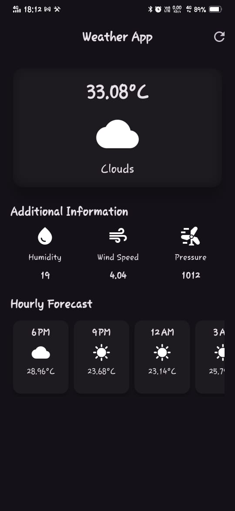
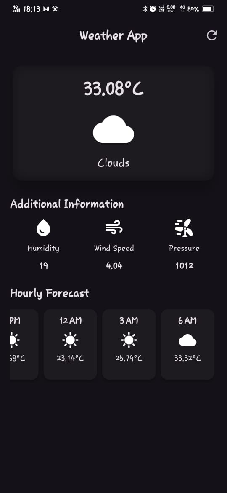

# Weather App

A simple yet functional Flutter-based weather application that fetches and displays real-time weather data for a specific city using OpenWeatherMap API.

## Features
- **Current Weather Display**: Shows temperature, weather condition, and an appropriate icon.
- **Additional Information**: Displays humidity, wind speed, and pressure.
- **Hourly Forecast**: Provides a 5-hour weather forecast with time, temperature, and weather condition.
- **Live Data Fetching**: Refresh functionality to get the latest weather updates.
- **Dark Theme UI**: Modern and visually appealing dark theme.

## Tech Stack

- **Flutter**: Cross-platform UI development.
- **Dart**: Programming language for Flutter.
- **BLoC (Business Logic Component)**: State management pattern implemented using the `flutter_bloc` package.
- **OpenWeatherMap API**: Fetches real-time weather data.
- **HTTP Package**: For API requests.
- **intl Package**: For date and time formatting.

## Setup & Installation
1. Clone the repository:
   ```sh
   git clone https://github.com/vedp18/flutter_weather_app.git
   ```
2. Navigate to the project directory:
   ```sh
   cd weather-app
   ```
3. Install dependencies:
   ```sh
   flutter pub get
   ```
4. Create a `secrets.dart` file inside the `lib` folder and add your OpenWeatherMap API key:
   ```dart
   const String weatherAPI = "YOUR_API_KEY_HERE";
   ```
5. Run the app:
   ```sh
   flutter run
   ```


The project follows the BLoC architecture, organized as:

```
lib/
├── bloc/
│   └── weather_bloc.dart
|   └── weather_event.dart
|   └── weather_state.dart
├── data/
|   ├── data_provider/
|   |   └── weather_data_provider.dart
|   └── repository/
|       └── weather_repository.dart
├── models/
│   └── weather_model.dart
├── ui/
│   ├── screens/
│   │   └── weather_screen.dart
│   └── widgets/
│       ├── additional_information.dart
│       └── hourly_forecasting_data.dart
├── app_bloc_observer.dart
└── main.dart
```

## API Usage
- The app fetches weather data using OpenWeatherMap API with the city name parameter.
- API Endpoint used:
  ```
  http://api.openweathermap.org/data/2.5/forecast?q=cityName,in&APPID=weatherAPI
  ```

## Screenshots
  

## Contact
Feel free to reach out at: **ved09003@gmail.com**

---


